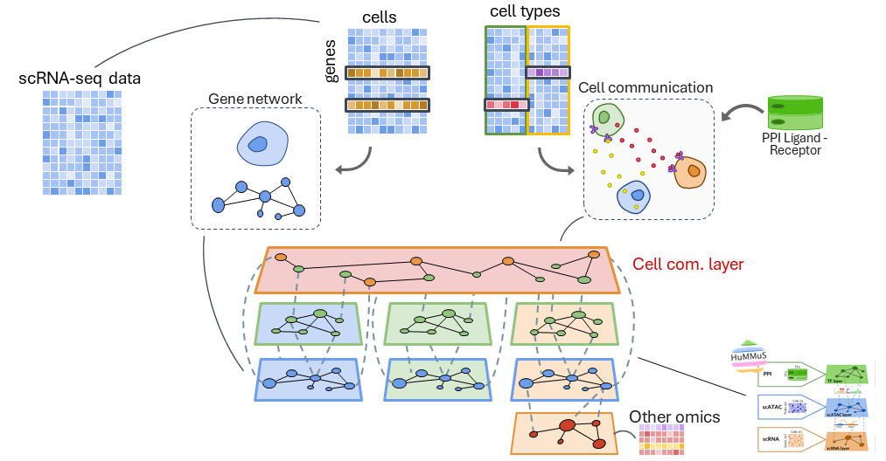
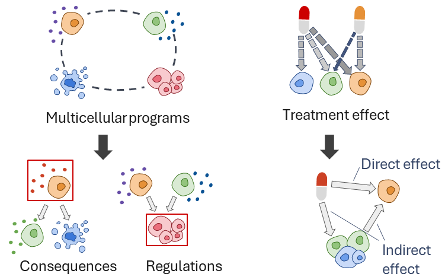
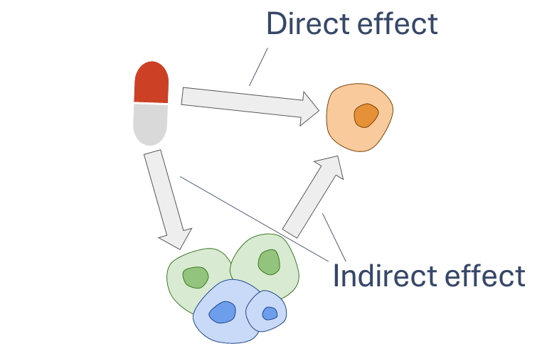
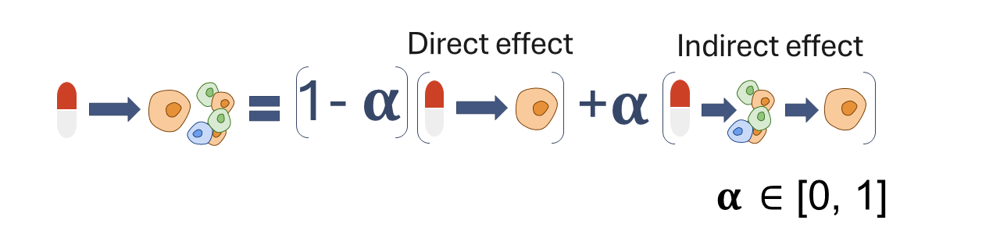
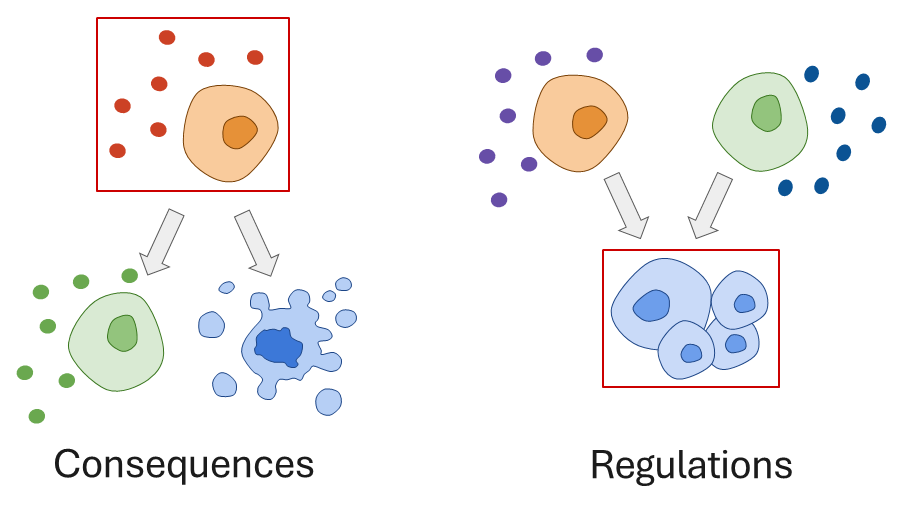

<p align="center">
  
</p>

## **ReCoN** is a new tool for reconstructing multicellular models.  

It combines both **gene regulatory networks** and **cell communication networks** to explore the molecular coordinations between multiple cell types — all at once.

ReCoN uses **heterogeneous multilayer networks** and integrates several layers of information into a **complex network**, ready to be explored and analyzed.  
Both the GRNs and intercellular networks are inferred from **single-cell RNA-seq data** (and optionally **scATAC-seq**).

<p align="center">
  
</p>

> 💡 **Philosophy behind ReCoN**  
> 🧬 *Cells do not act in isolation, but in a coordinated, dynamic system.*

<p align="center">
  
</p>

---

## 🚀 Use cases

- Predicting treatment effects in multicellular systems  
- Understanding multicellular program coordination  
- Exploring intracellular and intercellular regulatory mechanisms  
- Building GRNs through HuMMuS methodology  

---

## 📦 Installation

ReCoN is available as a Python package and can be installed through pip.

```bash
conda create -n recon python=3.10
conda activate recon
pip install recon[grn-lite]
```

⚠️ **To generate GRNs**, ReCoN requires **CellOracle** and **HuMMuS**.  
Since CellOracle needs older dependencies, we recommend using our [lite branch of CellOracle](https://github.com/cantinilab/CellOracle).

If you generate GRNs externally, install ReCoN without GRN dependencies to use newer Python versions:

```bash
pip install recon
```
> 📖 For installation issues, dependency conflicts, or runtime errors,  
> please check our dedicated [**Troubleshooting and FAQs guide**](docs/source/recon_explained/get_ready.rst).


---

## 💊 Treatment effects on multicellular systems

ReCoN predicts how a treatment (e.g., a drug) affects the molecular state of each cell type in a multicellular context (e.g., organ, tumor microenvironment).

It captures:
- **Direct effects** — treatment–receptor binding  
- **Indirect effects** — through intercellular communication  

<p align="center">
  
</p>

**Two components of treatment effect:**

- **Direct effect** — caused by *direct binding* of receptors of a cell type  
- **Indirect effect** — mediated by *other cell types* secreting ligands that modulate the focal cell  

ReCoN models these with random walk with restart (RWR).  
The parameter `α ∈ [0, 1]` sets the weight of the **direct effect** (`α`) vs **indirect effect** (`1-α`).

<p align="center">
  
</p>

> **Why indirect effects matter**  
> Neighboring cells can secrete ligands in response to a treatment, altering signaling in the focal cell.  
> Our evaluation showed **indirect effect dominance** (`α = 0.8`) gave the best performance.  
> *(Trimbour et al., 2025 — Immune Dictionary and Heart Failure showcases)*

---

## 🧫 Multicellular program coordination

How do surrounding cells regulate and get impacted by the state of a given cell type?  
ReCoN highlights **key molecules** and **cell types** involved in coordination.

<p align="center">
  
</p>

---

## ⚙️ Visualizing molecular cascades

ReCoN reconstructs intercellular cascades driving specific transcriptomic states, including:
- Intracellular regulators (receptors, TFs)  
- Intercellular signals (ligands and their regulators)  

This provides a comprehensive view of regulation and helps identify new targets.

---

## 🧬 Building GRNs with HuMMuS

HuMMuS (Trimbour et al., 2024) is a multilayer network method to build GRNs from single-cell RNA-seq and ATAC-seq.  

ReCoN integrates a Python implementation of HuMMuS, using CellOracle for prior TF–DNA–gene links.  
The multilayer (TFs, DNA regions, target genes) is then processed to infer the final GRN.

---

## 📖 Citation

If you use ReCoN, please cite:

> Trimbour, R., Cantini, L. (2025).  
> **ReCoN: Reconstructing multicellular models by integrating gene regulatory and cell communication networks.**  
> *bioRxiv*. https://doi.org/10.1101/2025.09.20.461080

If you also use ReCoN to generate GRNs, cite:

> Trimbour R., Ramirez Flores R. O., Saez Rodriguez J., Cantini L. (2025).  
> **ReCoN: Reconstructing multicellular models by integrating gene regulatory and cell communication networks.**  
> *bioRxiv*. https://doi.org/10.1101/2025.09.20.461080  
>
> Trimbour R., Deutschmann I. M., Cantini L. (2024).  
> **HuMMuS: Inferring gene regulatory networks through heterogeneous multilayer networks.**  
> *Bioinformatics*, 40(3), btae143. https://doi.org/10.1093/bioinformatics/btae143  

---


